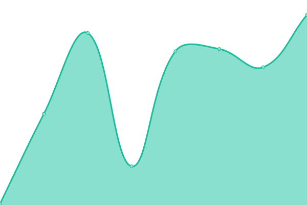

# [📈 Live Status](https://usevital.github.io/uptime): <!--live status--> **🟧 Partial outage**

This repository contains the open-source uptime monitor and status page for [Vital](https://notessential.blurry.gay), powered by [Upptime](https://github.com/upptime/upptime).

With [Upptime](https://upptime.js.org), you can get your own unlimited and free uptime monitor and status page, powered entirely by a GitHub repository. We use [Issues](https://github.com/usevital/uptime/issues) as incident reports, [Actions](https://github.com/usevital/uptime/actions) as uptime monitors, and [Pages](https://usevital.github.io/uptime) for the status page.

<!--start: status pages-->
<!-- This summary is generated by Upptime (https://github.com/upptime/upptime) -->
<!-- Do not edit this manually, your changes will be overwritten -->
<!-- prettier-ignore -->
| URL | Status | History | Response Time | Uptime |
| --- | ------ | ------- | ------------- | ------ |
|  [Vital Website](https://usevital.github.io/) | 🟩 Up | [vital-website.yml](https://github.com/usevital/uptime/commits/HEAD/history/vital-website.yml) | 

 103ms
     
 | 

<a href="https://usevital.github.io/uptime/history/vital-website">100.00%</a>
    

|  [NotEssential Website](https://notessential.blurry.gay/) | 🟥 Down | [not-essential-website.yml](https://github.com/usevital/uptime/commits/HEAD/history/not-essential-website.yml) | 

 404ms
     
 | 

<a href="https://usevital.github.io/uptime/history/not-essential-website">0.00%</a>
    

|  [Ward Website](https://ward.worldwidepixel.ca/) | 🟩 Up | [ward-website.yml](https://github.com/usevital/uptime/commits/HEAD/history/ward-website.yml) | 

 225ms
     
 | 

<a href="https://usevital.github.io/uptime/history/ward-website">100.00%</a>
    

<!--end: status pages-->

[**Visit our status website →**](https://usevital.github.io/uptime)

## 📄 License

- Powered by: [Upptime](https://github.com/upptime/upptime)
- Code: [MIT](./LICENSE) © [Anand Chowdhary](https://anandchowdhary.com), supported by [Pabio](https://pabio.com)
- Data in the `./history` directory: [Open Database License](https://opendatacommons.org/licenses/odbl/1-0/)
